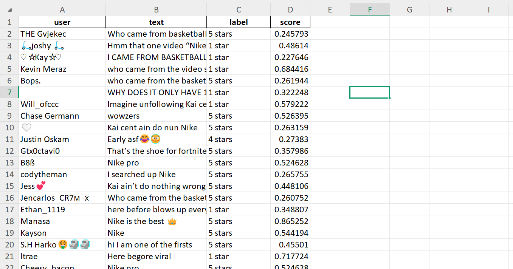
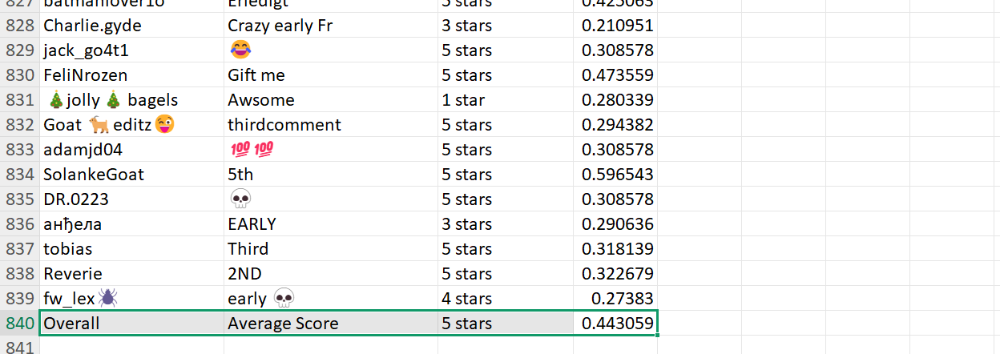

# TikTok Comment Analyzer

A Python application that extracts comments from TikTok videos, performs sentiment analysis, exports structured data to Excel, and visualizes the most common words using WordCloud.

---

# 📖 Project Overview

This project automates the analysis of TikTok comments.

Given a TikTok video URL, the application:

- Scrapes comments
- Extracts usernames
- Performs sentiment analysis
- Exports the results to Excel
- Generates a Word Cloud highlighting the most frequent words

The project can be used for social media analysis, customer feedback, and marketing research.

---

# ✨ Features

- Extract comments from TikTok videos
- Collect usernames
- Sentiment classification
- Export to Excel
- Generate WordCloud
- Fast automated workflow

---

# 🔄 Workflow

1. Paste TikTok video URL.
2. Scrape comments.
3. Clean text.
4. Perform sentiment analysis.
5. Export Excel report.
6. Generate WordCloud.

---

# 📊 Output

The generated Excel file contains:

- Username
- Comment
- Sentiment

The application also generates:

- Word Cloud
- Sentiment summary

---

# 🛠️ Technologies

- Python
- Pandas
- Selenium / Playwright *(حسب اللي استخدمته)*
- OpenPyXL
- NLTK / TextBlob / Transformers *(حسب اللي استخدمته)*
- WordCloud
- Matplotlib

---

# 📸 Screenshots

## Input


## Excel Output



## Sentiment Analysis



## Word Cloud


---

# 📂 Project Structure

```
app.py
README.md
requirements.txt
screenshots/
sample_output/
```

---

# 👨‍💻 My Contribution

This project was fully designed and developed by me.

Responsibilities included:

- TikTok comment scraping
- Data cleaning
- NLP preprocessing
- Sentiment analysis
- Excel reporting
- WordCloud generation
- Workflow automation

---

# 🚀 Installation

```bash
pip install -r requirements.txt
```

Run the application:

```bash
python app.py
```

---

# 👤 Author

Karim Maher

Data Science | Machine Learning | Flutter | Digital Marketing